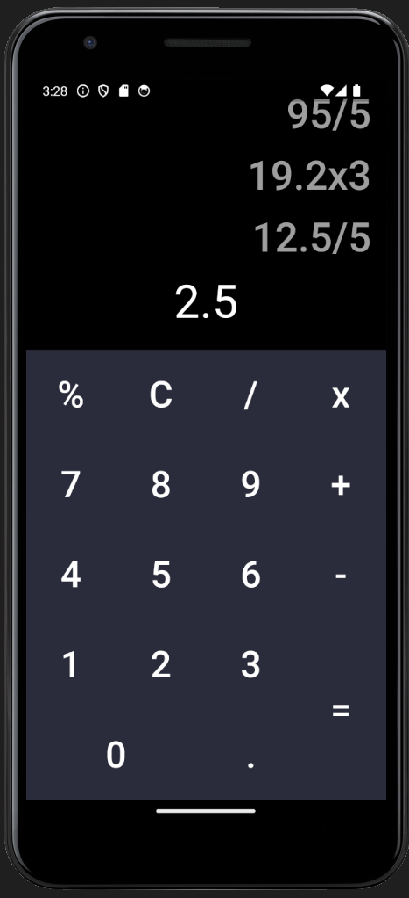

# calculatorproj

This is a beggineer project I'm making in flutter. I tried to keep a clean code architechture while also making a flexible keyboard resizesable for all screens. Feel free to tell me what things I can improve in my code.

